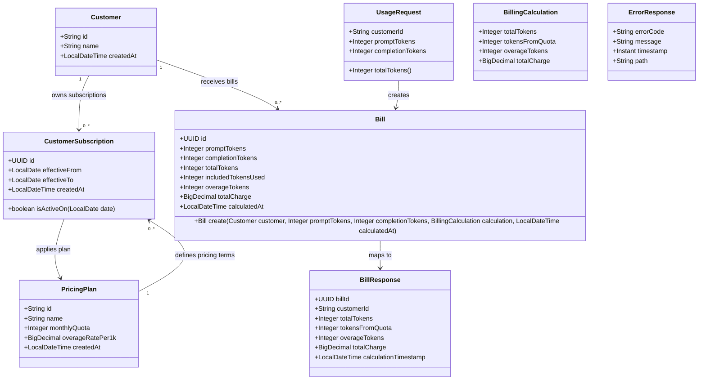

# Token Usage Billing API

## Requirements
- Implement token usage billing for LLM API customers by accepting usage submissions, calculating quota consumption and overage charges, persisting the bill, and returning bill details immediately.
- Validate that submitted usage belongs to an existing customer and that prompt/completion token counts are present and non-negative.
- Use the customer's active subscription pricing plan as the source of monthly quota and overage rate.
- Derive current-month usage from already persisted bills in the current UTC calendar month.
- Keep customer CRUD, historical bill query APIs, and monthly quota reset jobs outside the scope of this implementation.

## Entities

## Approach
1. API Design:
   - Expose `POST /api/usage` as the only endpoint for this story.
   - Accept a request with `customerId`, `promptTokens`, and `completionTokens`.
   - Return HTTP 201 with persisted bill details after successful calculation.
   - Return HTTP 404 with message `Customer not found` when the customer ID is syntactically valid but not present in the `customers` table.
   - Return HTTP 400 with message `Token count cannot be negative` when either token count is negative.
   - Return HTTP 400 for missing required fields, invalid JSON, or token totals that exceed the existing integer schema capacity.

2. Data and Persistence:
   - Preserve the existing Flyway schema and map JPA persistence objects to `customers`, `pricing_plans`, `customer_subscriptions`, and `bills`.
   - Use `pricing_plans.monthly_quota` and `pricing_plans.overage_rate_per_1k` through the customer's active subscription; do not duplicate quota or rate fields on customer.
   - Treat the `bills` table as the current usage ledger for this story; sum persisted bill `total_tokens` for the customer inside the current UTC calendar month.
   - Do not add a usage aggregate table or monthly reset process.
   - Supply UUID values and calculation timestamps from application code because the existing `bills` table does not define generated defaults for those fields.

3. Technical Implementation:
   - Use Spring Boot Web for the REST endpoint, Spring Validation for request validation, Spring Data JPA inside infrastructure persistence adapters, and Flyway-managed schema validation.
   - Use constructor injection for controllers, services, repository adapters, mappers, and the clock dependency.
   - Add a `Clock` bean using UTC so current-month calculations and tests are deterministic.
   - Use `@Transactional` around the billing calculation and bill persistence.
   - Acquire a pessimistic lock on the customer row before calculating current-month usage to serialize submissions for the same customer and avoid double-consuming included quota.
   - Use `GlobalExceptionHandler` for consistent API errors.

4. Business Logic:
   - Calculate `totalTokens` as `promptTokens + completionTokens`.
   - Determine the current UTC month window as `[first day of current month 00:00, first day of next month 00:00)`.
   - Select the active subscription where `effectiveFrom <= currentDate` and `effectiveTo` is null or `effectiveTo >= currentDate`; only one active subscription is allowed for a customer at a given date.
   - Calculate remaining quota as `max(monthlyQuota - currentMonthUsage, 0)`.
   - Calculate tokens from quota as `min(totalTokens, remainingQuota)`.
   - Calculate overage tokens as `totalTokens - tokensFromQuota`.
   - Calculate charge as `overageTokens * overageRatePer1k / 1000`, prorated per token, rounded to 2 decimal places with `HALF_UP`.
   - Allow zero-token submissions because the requirement permits token counts greater than or equal to zero; they create a zero-charge bill.

## Structure

### Inheritance Relationships
1. `BusinessException` extends `RuntimeException` and carries `errorCode`, `message`, and `HttpStatus`.
2. `CustomerNotFoundException` extends `BusinessException` for missing customer business failures.
3. `NoActiveSubscriptionException` extends `BusinessException` for customers that exist but cannot be billed because no active subscription is available.
4. `UsageService` interface defines the usage billing use case consumed by controllers.
5. `BillingServiceImpl` implements `UsageService` and contains application business orchestration.
6. Domain models are pure Java objects with no JPA annotations, Spring annotations, or framework base classes.
7. Persistence objects use the `PO` suffix and are the only table-mapped classes.
8. Repository adapters implement domain repository interfaces and delegate to Spring Data JPA repositories.

### Dependencies
1. `UsageController` injects the `UsageService` interface, not `BillingServiceImpl` directly.
2. `BillingServiceImpl` injects `CustomerRepository`, `CustomerSubscriptionRepository`, `BillRepository`, and `Clock`; these repositories are domain-facing interfaces under `repository`.
3. Services must not depend on Spring Data JPA repositories or persistence objects.
4. `CustomerRepository`, `CustomerSubscriptionRepository`, and `BillRepository` expose domain-oriented methods and return domain models or domain values.
5. `JpaCustomerRepositoryAdapter`, `JpaCustomerSubscriptionRepositoryAdapter`, and `JpaBillRepositoryAdapter` live under `infrastructure/persistence` and implement the corresponding repository interfaces.
6. Spring Data JPA repositories live under `infrastructure/persistence` and are used only by repository adapters.
7. Persistence objects live under `infrastructure/persistence/entity` with the `PO` suffix.
8. Mappers live under `infrastructure/persistence/mapper` and convert between domain models and persistence objects.
9. `GlobalExceptionHandler` depends on no application services and converts validation, business, and system exceptions into `ErrorResponse`.

### Layered Architecture
Only the first three items are application layers; the remaining items are supporting areas that must not invert the controller -> service -> repository dependency direction.

1. Controller Layer: Owns HTTP route mapping, request body validation trigger, status code selection, and response DTO delivery.
2. Service Layer: Owns customer existence validation, subscription selection, current-month usage calculation, billing calculation, transaction boundary, and bill persistence through repository interfaces.
3. Repository Layer: Owns domain-facing persistence contracts and hides storage details from services.
4. Infrastructure Persistence Area: Implements the repository layer with Spring Data JPA adapters, persistence objects, and domain-to-PO mappers; this is an implementation detail of the repository layer, not a separate business layer.
5. Domain Model Area: Contains pure Java domain objects and value objects used by services and repository interfaces.
6. Exception Handling Area: Owns `GlobalExceptionHandler`, business exception mapping, validation error mapping, and response body consistency.
7. Test Area: Uses Spring Boot integration tests with MockMvc and a test database profile to verify API behavior through the three-layer flow.

## Operations

### Create Domain Models - Customer, PricingPlan, CustomerSubscription, Bill
1. Responsibility: Represent billing business concepts as pure Java domain objects independent of persistence and web frameworks.
2. Location:
   - Place domain classes under `domain/model`.
3. Attributes:
   - `Customer.id`: `String` - customer identifier.
   - `Customer.name`: `String` - customer display name.
   - `Customer.createdAt`: `LocalDateTime` - creation timestamp.
   - `PricingPlan.id`: `String` - plan identifier.
   - `PricingPlan.name`: `String` - plan name.
   - `PricingPlan.monthlyQuota`: `Integer` - included monthly token quota.
   - `PricingPlan.overageRatePer1k`: `BigDecimal` - monetary rate charged per 1,000 overage tokens.
   - `PricingPlan.createdAt`: `LocalDateTime` - creation timestamp.
   - `CustomerSubscription.id`: `UUID` - subscription identifier.
   - `CustomerSubscription.customer`: `Customer` - customer owner.
   - `CustomerSubscription.pricingPlan`: `PricingPlan` - applicable pricing terms.
   - `CustomerSubscription.effectiveFrom`: `LocalDate` - first active date.
   - `CustomerSubscription.effectiveTo`: `LocalDate` - optional last active date.
   - `CustomerSubscription.createdAt`: `LocalDateTime` - creation timestamp.
   - `Bill.id`: `UUID` - bill identifier supplied by application code.
   - `Bill.customer`: `Customer` - billed customer.
   - `Bill.promptTokens`: `Integer` - submitted prompt tokens.
   - `Bill.completionTokens`: `Integer` - submitted completion tokens.
   - `Bill.totalTokens`: `Integer` - prompt plus completion tokens.
   - `Bill.includedTokensUsed`: `Integer` - tokens charged against included quota.
   - `Bill.overageTokens`: `Integer` - tokens charged as overage.
   - `Bill.totalCharge`: `BigDecimal` - final charge rounded to 2 decimal places.
   - `Bill.calculatedAt`: `LocalDateTime` - calculation timestamp in UTC local date-time representation.
4. Methods:
   - Domain constructors or factories validate only domain invariants that do not depend on HTTP or database concerns.
   - `isActiveOn(LocalDate date): boolean`
     - Logic:
       - Return true when `effectiveFrom` is on or before `date`.
       - Return true only when `effectiveTo` is null or on/after `date`.
   - `static create(Customer customer, Integer promptTokens, Integer completionTokens, BillingCalculation calculation, LocalDateTime calculatedAt): Bill`
     - Logic:
       - Generate a UUID.
       - Copy prompt, completion, and total token values from method arguments and calculation.
       - Copy quota, overage, charge, customer, and timestamp values from calculation context.
5. Annotations:
   - Domain classes must have no JPA annotations, Spring annotations, or persistence-specific annotations.
6. Constraints:
   - Domain classes must not live under `infrastructure`.
   - Domain classes must not reference persistence objects.
   - Domain classes must not be exposed directly as request or response DTOs.

### Create Value Object - BillingCalculation
1. Responsibility: Carry the result of the billing calculation before it is persisted.
2. Location:
   - Place this value object under `domain/model` or another domain package, not under infrastructure.
3. Attributes:
   - `totalTokens`: `Integer` - full submitted token count.
   - `tokensFromQuota`: `Integer` - portion covered by remaining quota.
   - `overageTokens`: `Integer` - portion billed at overage rate.
   - `totalCharge`: `BigDecimal` - rounded charge.
4. Methods:
   - `static calculate(Integer totalTokens, long currentMonthUsage, Integer monthlyQuota, BigDecimal overageRatePer1k): BillingCalculation`
     - Logic:
       - Compute remaining quota as `max(monthlyQuota - currentMonthUsage, 0)`.
       - Compute quota tokens as the smaller of submitted tokens and remaining quota.
       - Compute overage tokens as submitted tokens minus quota tokens.
       - Compute charge by prorating the per-1K rate per token and round to scale 2 using `HALF_UP`.
5. Constraints:
   - Use `BigDecimal` for all monetary arithmetic.
   - Use `long` for intermediate quota and usage arithmetic to avoid overflow.
   - Keep this object free of Spring and JPA annotations.

### Create DTOs - UsageRequest, BillResponse, ErrorResponse
1. Responsibility: Define the external API contract without exposing domain internals or persistence objects.
2. Location:
   - Place request and response DTOs near the controller boundary, such as under `controller/dto`.
3. Attributes:
   - `UsageRequest.customerId`: `String` - required existing customer ID.
   - `UsageRequest.promptTokens`: `Integer` - required non-negative prompt token count.
   - `UsageRequest.completionTokens`: `Integer` - required non-negative completion token count.
   - `BillResponse.billId`: `UUID` - persisted bill identifier.
   - `BillResponse.customerId`: `String` - customer owner.
   - `BillResponse.totalTokens`: `Integer` - submitted total token count.
   - `BillResponse.tokensFromQuota`: `Integer` - quota-covered tokens.
   - `BillResponse.overageTokens`: `Integer` - overage tokens.
   - `BillResponse.totalCharge`: `BigDecimal` - final charge.
   - `BillResponse.calculationTimestamp`: `LocalDateTime` - bill calculation timestamp.
   - `ErrorResponse.errorCode`: `String` - stable error code.
   - `ErrorResponse.message`: `String` - user-facing message.
   - `ErrorResponse.timestamp`: `Instant` - error response timestamp.
   - `ErrorResponse.path`: `String` - request path.
4. Methods:
   - `UsageRequest.totalTokens(): Integer`
     - Logic:
       - Add prompt and completion tokens after null and negative validation.
       - Reject totals greater than `Integer.MAX_VALUE`.
   - `BillResponse.from(Bill bill): BillResponse`
     - Logic:
       - Map persisted bill fields to response fields.
5. Annotations:
   - Use Java records or simple immutable classes for DTOs.
   - Apply `@NotBlank` to `customerId`.
   - Apply `@NotNull` and `@Min(value = 0, message = "Token count cannot be negative")` to token fields.
6. Constraints:
   - Negative prompt or completion tokens must produce HTTP 400 with message `Token count cannot be negative`.
   - Missing fields must produce HTTP 400 but must not be converted into `Customer not found`.
   - DTOs may use validation annotations because they belong to the controller boundary, not the domain model.

### Create Persistence Objects - CustomerPO, PricingPlanPO, CustomerSubscriptionPO, BillPO
1. Responsibility: Map the existing Flyway-managed tables without leaking JPA concerns into domain models or services.
2. Location:
   - Place all persistence objects under `infrastructure/persistence/entity`.
   - Use the `PO` suffix for every persistence object.
3. Attributes:
   - `CustomerPO` maps `customers.id`, `customers.name`, and `customers.created_at`.
   - `PricingPlanPO` maps `pricing_plans.id`, `pricing_plans.name`, `pricing_plans.monthly_quota`, `pricing_plans.overage_rate_per_1k`, and `pricing_plans.created_at`.
   - `CustomerSubscriptionPO` maps `customer_subscriptions.id`, `customer_subscriptions.customer_id`, `customer_subscriptions.plan_id`, `customer_subscriptions.effective_from`, `customer_subscriptions.effective_to`, and `customer_subscriptions.created_at`.
   - `BillPO` maps `bills.id`, `bills.customer_id`, `bills.prompt_tokens`, `bills.completion_tokens`, `bills.total_tokens`, `bills.included_tokens_used`, `bills.overage_tokens`, `bills.total_charge`, and `bills.calculated_at`.
4. Annotations:
   - Persistence objects use the required JPA table, column, identifier, and relationship annotations.
   - Persistence annotations are allowed only on `PO` classes.
5. Constraints:
   - Do not place persistence objects under domain packages.
   - Do not return persistence objects from repository interfaces.
   - Do not pass persistence objects into service methods.

### Create Persistence Mappers - CustomerPersistenceMapper, PricingPlanPersistenceMapper, CustomerSubscriptionPersistenceMapper, BillPersistenceMapper
1. Responsibility: Convert between domain objects and persistence objects.
2. Location:
   - Place mappers under `infrastructure/persistence/mapper`.
3. Methods:
   - `CustomerPersistenceMapper.toDomain(CustomerPO po): Customer`
     - Logic:
       - Convert table-mapped customer state into a pure domain customer.
   - `CustomerPersistenceMapper.toPO(Customer customer): CustomerPO`
     - Logic:
       - Convert domain customer state into a persistence object when required by adapter operations.
   - `PricingPlanPersistenceMapper.toDomain(PricingPlanPO po): PricingPlan`
     - Logic:
       - Preserve quota and rate values exactly.
   - `CustomerSubscriptionPersistenceMapper.toDomain(CustomerSubscriptionPO po): CustomerSubscription`
     - Logic:
       - Convert nested customer and pricing plan persistence objects to domain objects using the corresponding mappers.
   - `BillPersistenceMapper.toDomain(BillPO po): Bill`
     - Logic:
       - Convert persisted bill state into a pure domain bill.
   - `BillPersistenceMapper.toPO(Bill bill): BillPO`
     - Logic:
       - Convert a domain bill into a persistence object with customer relationship set for saving.
4. Annotations:
   - Mappers may be Spring components.
5. Constraints:
   - Mappers are the only components that know both domain types and persistence object types.
   - Mappers must not contain billing business rules.

### Create Repository Interfaces - CustomerRepository, CustomerSubscriptionRepository, BillRepository
1. Responsibility: Define domain-facing persistence contracts under `repository`.
2. Methods:
   - `CustomerRepository.findById(String id): Optional<Customer>`
     - Logic:
       - Used for customer existence checks when a lock is not needed.
   - `CustomerRepository.findByIdForUpdate(String id): Optional<Customer>`
     - Logic:
       - Use pessimistic write locking for the customer row during billing.
   - `CustomerSubscriptionRepository.findActiveSubscription(String customerId, LocalDate date): Optional<CustomerSubscription>`
     - Logic:
       - Fetch the single active subscription with pricing plan where the date falls inside the effective range.
       - Return empty when no active subscription exists.
   - `BillRepository.sumTotalTokensForCustomerBetween(String customerId, LocalDateTime startInclusive, LocalDateTime endExclusive): Long`
     - Logic:
       - Sum `totalTokens` for the customer in the current month window.
       - Return zero when no bills exist.
   - `BillRepository.save(Bill bill): Bill`
     - Logic:
       - Persist the calculated bill.
3. Annotations:
   - Repository interfaces under `repository` must not use Spring Data JPA annotations.
4. Constraints:
   - Repository interfaces must use domain models and domain value types.
   - Repository interfaces must not expose persistence objects.
   - Services depend on these interfaces only.

### Create Spring Data Repositories - CustomerJpaRepository, SpringDataCustomerSubscriptionRepository, BillJpaRepository
1. Responsibility: Provide Spring Data JPA access to persistence objects for repository adapters.
2. Location:
   - Place Spring Data repositories under `infrastructure/persistence`.
3. Methods:
   - `CustomerJpaRepository.findById(String id): Optional<CustomerPO>`
     - Logic:
       - Load a customer persistence object by ID.
   - `CustomerJpaRepository.findByIdForUpdate(String id): Optional<CustomerPO>`
     - Logic:
       - Use pessimistic write locking for the customer row during billing.
   - `SpringDataCustomerSubscriptionRepository.findActiveSubscription(String customerId, LocalDate date): Optional<CustomerSubscriptionPO>`
     - Logic:
       - Query the active subscription where the effective date range contains the given date and fetch the pricing plan needed for billing.
       - Return empty when no active subscription exists.
   - `BillJpaRepository.sumTotalTokensForCustomerBetween(String customerId, LocalDateTime startInclusive, LocalDateTime endExclusive): Long`
     - Logic:
       - Sum bill `totalTokens` for the customer in the current month window.
       - Return zero when no matching bills exist.
   - `BillJpaRepository.save(BillPO bill): BillPO`
     - Logic:
       - Persist the calculated bill persistence object.
4. Annotations:
   - Spring Data repositories extend `JpaRepository` and may use query and lock annotations.
5. Constraints:
   - Spring Data repositories are infrastructure-only and must not be injected into services or controllers.

### Create Repository Adapters - JpaCustomerRepositoryAdapter, JpaCustomerSubscriptionRepositoryAdapter, JpaBillRepositoryAdapter
1. Responsibility: Implement domain repository interfaces by delegating to Spring Data repositories and persistence mappers.
2. Location:
   - Place adapters under `infrastructure/persistence`.
3. Methods:
   - `JpaCustomerRepositoryAdapter.findById(String id): Optional<Customer>`
     - Logic:
       - Delegate to `CustomerJpaRepository`.
       - Map `CustomerPO` to `Customer`.
   - `JpaCustomerRepositoryAdapter.findByIdForUpdate(String id): Optional<Customer>`
     - Logic:
       - Delegate to the locked Spring Data lookup.
       - Map `CustomerPO` to `Customer`.
   - `JpaCustomerSubscriptionRepositoryAdapter.findActiveSubscription(String customerId, LocalDate date): Optional<CustomerSubscription>`
     - Logic:
       - Delegate to `SpringDataCustomerSubscriptionRepository`.
       - Map the returned `CustomerSubscriptionPO` to one `CustomerSubscription` when present.
   - `JpaBillRepositoryAdapter.sumTotalTokensForCustomerBetween(String customerId, LocalDateTime startInclusive, LocalDateTime endExclusive): Long`
     - Logic:
       - Delegate to `BillJpaRepository`.
       - Normalize null sums to zero.
   - `JpaBillRepositoryAdapter.save(Bill bill): Bill`
     - Logic:
       - Map domain `Bill` to `BillPO`.
       - Save through `BillJpaRepository`.
       - Map the saved `BillPO` back to domain `Bill`.
4. Annotations:
   - Adapters are Spring repository components.
5. Constraints:
   - Adapters are the only persistence components that implement repository interfaces.
   - Adapters must not contain billing calculation rules.

### Create Service Interface - UsageService
1. Responsibility: Define the usage billing application use case for controllers.
2. Location:
   - Place the interface under `service`.
3. Methods:
   - `submitUsage(UsageRequest request): BillResponse`
     - Logic:
       - Contract accepts validated API request data and returns bill response data.
4. Constraints:
   - Controllers depend on this interface only.
   - The interface must not expose infrastructure persistence types.

### Implement Service - BillingServiceImpl
1. Responsibility: Orchestrate validation, customer locking, subscription selection, current usage lookup, calculation, persistence, and response mapping.
2. Location:
   - Place the implementation under `service` or `service/impl`, while keeping the `UsageService` interface under `service`.
3. Core Methods:
   - `submitUsage(UsageRequest request): BillResponse`
     - Logic:
       - Delegate to private `calculateBill(request)`.
       - Preserve the public service interface contract while keeping billing orchestration in one private method.
   - `calculateBill(UsageRequest request): BillResponse`
     - Input Validation:
       - Call `calculateTotalTokens(request)` to verify total token calculation does not exceed `Integer.MAX_VALUE`.
     - Business Logic:
       - Capture `now` from injected UTC `Clock`.
       - Call `validateCustomerExists(request.customerId())` to load and lock the customer.
       - Call `resolveActivePricingPlan(customer.id())` to obtain the active pricing plan.
       - Call `calculateRemainingQuota(customer.id(), plan)` to derive remaining monthly quota from current-month bill usage.
       - Derive the usage value passed into `BillingCalculation.calculate(...)` from plan quota and remaining quota so the existing calculation contract remains unchanged.
       - Calculate quota tokens, overage tokens, and total charge.
       - Create and save a bill.
       - Return `BillResponse.from(savedBill)`.
     - Exception Handling:
       - Throw business exceptions only for expected business failures.
       - Let unexpected persistence/system failures propagate to the global handler.
     - Return Value:
       - Return a response containing bill ID, customer ID, total tokens, quota tokens, overage tokens, total charge, and timestamp.
   - `validateCustomerExists(String customerId): Customer`
     - Logic:
       - Load the customer with `findByIdForUpdate(customerId)`.
       - Throw `CustomerNotFoundException` when the customer does not exist.
       - Return the locked customer domain model.
   - `resolveActivePricingPlan(String customerId): PricingPlan`
     - Logic:
       - Use `LocalDate.now(clock)` as the current UTC date.
       - Load the active subscription with `findActiveSubscription(customerId, currentDate).orElseThrow(...)`.
       - Throw `NoActiveSubscriptionException` when no active subscription exists.
       - Return the pricing plan from the active subscription.
   - `calculateRemainingQuota(String customerId, PricingPlan plan): long`
     - Logic:
       - Use `LocalDate.now(clock)` to derive the current UTC month window.
       - Sum current-month usage with `BillRepository.sumTotalTokensForCustomerBetween(customerId, monthStart, monthEnd)`.
       - Return `max(plan.monthlyQuota - currentMonthUsage, 0)`.
   - `calculateTotalTokens(UsageRequest request): int`
     - Logic:
       - Add prompt and completion tokens using a wide intermediate value.
       - Throw `BusinessException` with error code `TOKEN_TOTAL_TOO_LARGE` and message `Token total exceeds supported limit` when the total exceeds `Integer.MAX_VALUE`.
       - Return the total as an integer.
4. Dependency Injection:
   - Inject `CustomerRepository`, `CustomerSubscriptionRepository`, `BillRepository`, and `Clock` through constructor injection.
   - These repositories are domain-facing interfaces from `repository`, not Spring Data JPA repositories.
5. Transaction Management:
   - Annotate `submitUsage` with `@Transactional`.
   - Keep customer lock, usage summation, bill creation, and save in the same transaction.
6. Constraints:
   - The service implementation must implement `UsageService`.
   - The service must not depend on persistence objects, Spring Data JPA repositories, or persistence mappers.

### Create Controller - UsageController
1. Responsibility: Expose the usage submission API.
2. Methods:
   - `submitUsage(@Valid @RequestBody UsageRequest request): ResponseEntity<BillResponse>`
     - Logic:
       - Delegate to `UsageService.submitUsage`.
       - Return HTTP 201 with the service response.
3. Annotations:
   - `@RestController`, `@RequestMapping("/api/usage")`, `@PostMapping`.
4. Constraints:
   - Do not add GET, PUT, DELETE, customer CRUD, or historical bill endpoints.
   - Do not perform billing logic in the controller.
   - Inject `UsageService`, not `BillingServiceImpl`.

### Create Exceptions - BusinessException, CustomerNotFoundException, NoActiveSubscriptionException
1. Responsibility: Represent expected business failures with stable status codes and messages.
2. Attributes:
   - `errorCode`: `String` - stable machine-readable code.
   - `errorMessage`: `String` - user-facing message.
   - `httpStatus`: `HttpStatus` - response status.
3. Constructors:
   - `BusinessException(String errorCode, String errorMessage, HttpStatus httpStatus)`.
   - `CustomerNotFoundException()` sets status 404 and message `Customer not found`.
   - `NoActiveSubscriptionException(String customerId)` sets status 409 and message `Active subscription not found`.
4. Usage Scenarios:
   - Throw `CustomerNotFoundException` only after a valid request names a customer ID that does not exist.
   - Throw `NoActiveSubscriptionException` when a customer exists but no subscription can provide pricing terms for the calculation date.

### Create Exception Handler - GlobalExceptionHandler
1. Responsibility: Provide unified API error handling.
2. Exception Types:
   - `BusinessException`: return its status and message.
   - `MethodArgumentNotValidException`: return HTTP 400 for bean validation failures.
   - `HttpMessageNotReadableException`: return HTTP 400 for invalid JSON.
   - Generic `Exception`: return HTTP 500 with a non-sensitive message.
3. Methods:
   - `handleBusinessException(BusinessException ex, HttpServletRequest request): ResponseEntity<ErrorResponse>`
   - `handleValidationException(MethodArgumentNotValidException ex, HttpServletRequest request): ResponseEntity<ErrorResponse>`
   - `handleUnreadableMessage(HttpMessageNotReadableException ex, HttpServletRequest request): ResponseEntity<ErrorResponse>`
   - `handleUnexpected(Exception ex, HttpServletRequest request): ResponseEntity<ErrorResponse>`
4. Annotations:
   - `@RestControllerAdvice`, `@ExceptionHandler`.
5. Response Format:
   - Always return `ErrorResponse`.
   - If any validation error message is `Token count cannot be negative`, use that exact response message.
   - For missing required fields, return HTTP 400 with `Required field is missing`.
   - For invalid JSON, return HTTP 400 with `Invalid request body`.
   - Do not expose stack traces, SQL errors, or internal class names.

### Create Configuration - TimeConfig
1. Responsibility: Provide a single testable time source.
2. Methods:
   - `clock(): Clock`
     - Logic:
       - Return `Clock.systemUTC()`.
3. Annotations:
   - `@Configuration`, `@Bean`.
4. Constraints:
   - Billing month calculations must use this clock, not direct calls to `LocalDateTime.now()`.

### Create Integration Tests - UsageControllerIntegrationTest
1. Responsibility: Verify acceptance criteria through the HTTP API and persisted database state.
2. Test Setup:
   - Use `@SpringBootTest` and `@AutoConfigureMockMvc`.
   - Use a test profile with an H2 in-memory database configured for PostgreSQL compatibility, or another project-approved PostgreSQL test database.
   - Let Flyway create the schema and seed customers/plans/subscriptions.
   - Insert prior bill rows in tests when AC3 or AC4 needs current-month usage.
   - Override `Clock` in test configuration to a fixed instant inside May 2026 so seed subscriptions are active and month windows are deterministic.
3. Test Cases:
   - Nonexistent customer returns HTTP 404 and response message `Customer not found`.
   - Negative prompt tokens returns HTTP 400 and response message `Token count cannot be negative`.
   - Negative completion tokens returns HTTP 400 and response message `Token count cannot be negative`.
   - Missing customer ID returns HTTP 400 and does not attempt customer lookup.
   - Missing token field returns HTTP 400.
   - With 60,000 current-month prior tokens and a 30,000-token submission for `CUST-001`, response has 30,000 quota tokens, zero overage, and 0.00 charge.
   - With 80,000 current-month prior tokens and a 50,000-token submission for `CUST-001`, response has 20,000 quota tokens, 30,000 overage tokens, and 0.60 charge.
   - A valid request returns HTTP 201, response includes all required bill fields, and a bill row is persisted.
4. Constraints:
   - Tests must not require customer CRUD APIs.
   - Tests must not assert any out-of-scope historical bill query endpoint.
   - Tests should exercise controller -> service interface -> repository interface -> infrastructure adapter flow through application wiring.

## Norms
1. Annotation Standards:
   - Controllers use `@RestController`, route-level `@RequestMapping`, method-level HTTP annotations, and `@Valid` request bodies.
   - Service interfaces do not use persistence annotations; service implementations use `@Service` and transaction annotations on business methods that write data.
   - Domain repository interfaces under `repository` do not extend `JpaRepository` and do not use Spring Data annotations.
   - Repository adapters under `infrastructure/persistence` use Spring stereotypes and implement domain repository interfaces.
   - Spring Data JPA repositories under `infrastructure/persistence` extend `JpaRepository` and use query or lock annotations for non-trivial access.
   - Persistence objects under `infrastructure/persistence/entity` use JPA table, column, identifier, and relationship annotations.
   - Domain models under `domain/model` must not use Spring, JPA, validation, or persistence annotations.

2. Dependency Injection:
   - Use constructor injection only.
   - Avoid field injection.
   - Inject `Clock` wherever current time is needed.
   - Controllers depend on service interfaces, not service implementations.
   - Services depend on repository interfaces under `repository`, not Spring Data JPA repositories.
   - Repository adapters depend on Spring Data repositories and persistence mappers.
   - Spring Data repositories and persistence mappers must not be injected into controllers or services.

3. Exception Handling:
   - Use `BusinessException` for expected business failures.
   - Business exceptions must include `errorCode`, `errorMessage`, and `HttpStatus`.
   - `CustomerNotFoundException` must preserve exact message `Customer not found`.
   - Validation handling must preserve exact message `Token count cannot be negative` for negative token counts.
   - All API errors must be handled through `GlobalExceptionHandler` and returned as `ErrorResponse`.

4. Data Validation:
   - Request DTO token fields must be nullable wrapper types so missing values can be distinguished from zero.
   - Use `@NotBlank` for customer ID.
   - Use `@NotNull` and `@Min(0)` for token counts.
   - Reject token totals beyond the existing integer schema capacity.

5. Monetary Calculation:
   - Use `BigDecimal` for rates and charges.
   - Never use floating point arithmetic for billing.
   - Prorate overage rate per token from the per-1K rate.
   - Persist and return charge rounded to scale 2 with `RoundingMode.HALF_UP`.

6. Persistence:
   - Keep persistence object mappings aligned with the existing Flyway schema because Hibernate is configured with `ddl-auto: validate`.
   - Use the `PO` suffix for all JPA persistence objects.
   - Place all `PO` classes under `infrastructure/persistence/entity`.
   - Place Domain-to-PO mappers under `infrastructure/persistence/mapper`.
   - Keep all Spring Data JPA repository interfaces under `infrastructure/persistence`.
   - Keep all repository adapter implementations under `infrastructure/persistence`.
   - Keep domain repository interfaces under `repository`.
   - Do not introduce schema migrations unless implementation discovers a strict validation mismatch that cannot be solved by mapping.
   - Use application-generated UUIDs for `bills.id`.
   - Do not expose persistence objects outside infrastructure persistence components.

7. Testing:
   - Cover every acceptance criterion with an API-level test.
   - Use deterministic time.
   - Seed prior usage directly through persistence/test setup, not by adding historical query APIs.
   - Verify both response values and persisted bill values for successful submissions.
   - Test application wiring through controller -> service interface -> repository interface -> adapter, not by bypassing the architecture in API tests.

8. Documentation and Comments:
   - Use comments only for non-obvious business rules such as UTC month window calculation and charge rounding.
   - Keep public API names aligned with the requirement: usage, bill, customer, quota, overage, charge.
   - Use the term "domain model" for pure Java business objects and "PO" for persistence objects to avoid ambiguity.

## Safeguards
1. Functional Constraints:
   - Only implement `POST /api/usage`.
   - Do not implement customer CRUD operations.
   - Do not implement historical bill query endpoints.
   - Do not implement scheduled monthly quota reset logic.
   - One valid usage submission must synchronously create one persisted bill.

2. Acceptance Criteria Constraints:
   - Missing customer after valid request validation must return HTTP 404 with message `Customer not found`.
   - Negative prompt or completion tokens must return HTTP 400 with message `Token count cannot be negative`.
   - For quota-remaining scenarios, submitted tokens must be allocated to quota before overage.
   - For over-quota scenarios, only tokens exceeding the remaining monthly quota may be charged.
   - Successful responses must return HTTP 201 and include bill ID, customer ID, total tokens, quota tokens, overage tokens, total charge, and timestamp.

3. Business Rule Constraints:
   - Customer quota and overage rate come from the active pricing plan, not from the customer table.
   - Active subscription is selected using UTC current date.
   - Only one active subscription is allowed for a customer at a given UTC date.
   - Current-month usage is calculated from persisted bills whose `calculatedAt` is within the current UTC calendar month.
   - Zero-token submissions are valid and create zero-charge bills.
   - Duplicate submissions are not deduplicated because no idempotency key is in scope.

4. Data Constraints:
   - Token counts must be present and non-negative.
   - Token totals must fit the existing `INTEGER` columns.
   - Bill amounts must fit `DECIMAL(10, 2)`.
   - Overage rate must fit existing `DECIMAL(10, 4)`.
   - Timestamps are stored as `LocalDateTime` values derived from the UTC clock.

5. Technical Constraints:
   - Preserve existing table names and column names.
   - Keep Hibernate schema validation passing.
   - Keep customer lock, usage summation, and bill insert in one transaction.
   - Maintain the logical three-layer architecture: controller -> service -> repository.
   - Treat infrastructure persistence as the repository layer implementation detail, not as a dependency target for controllers or services.
   - Controllers must depend on service interfaces only.
   - Services must depend on repository interfaces only.
   - Services must not depend on Spring Data repositories, persistence objects, or persistence mappers.
   - Domain models must be pure Java objects with no JPA annotations, Spring annotations, or persistence-specific imports.
   - Persistence objects must live under `infrastructure/persistence/entity` and must use the `PO` suffix.
   - JPA and Spring Data implementations must live under `infrastructure/persistence` as adapters or adapter-owned repositories.
   - Domain-to-PO mappers must live under `infrastructure/persistence/mapper`.
   - Repository interfaces must live under `repository`.
   - Avoid adding new dependencies unless tests cannot run with the current Gradle setup.
   - Avoid introducing unnecessary base classes or wrapper entities beyond the requested service and repository interfaces.

6. Performance Constraints:
   - Usage summation must filter by customer ID and month range.
   - The implementation should use existing `idx_bills_customer_id` and `idx_bills_calculated_at` indexes.
   - The first implementation can calculate current-month usage from bills directly; if bill volume becomes high, a future usage aggregate can be considered outside this story.

7. Security Constraints:
   - Do not expose stack traces, SQL messages, or internal exception class names in API responses.
   - Treat customer ID as an opaque identifier.
   - Do not log full request bodies at error level.

8. Integration Constraints:
   - The endpoint must work with the PostgreSQL schema configured in `application.yml`.
   - Tests may use H2 only if Flyway migrations and persistence object mappings remain compatible.
   - The implementation must not depend on external metering or billing services.

9. API Constraints:
   - The request body must use JSON.
   - The response body must use JSON.
   - Successful creation uses HTTP 201.
   - Business and validation errors use structured `ErrorResponse` bodies with stable `message` values for acceptance criteria.
